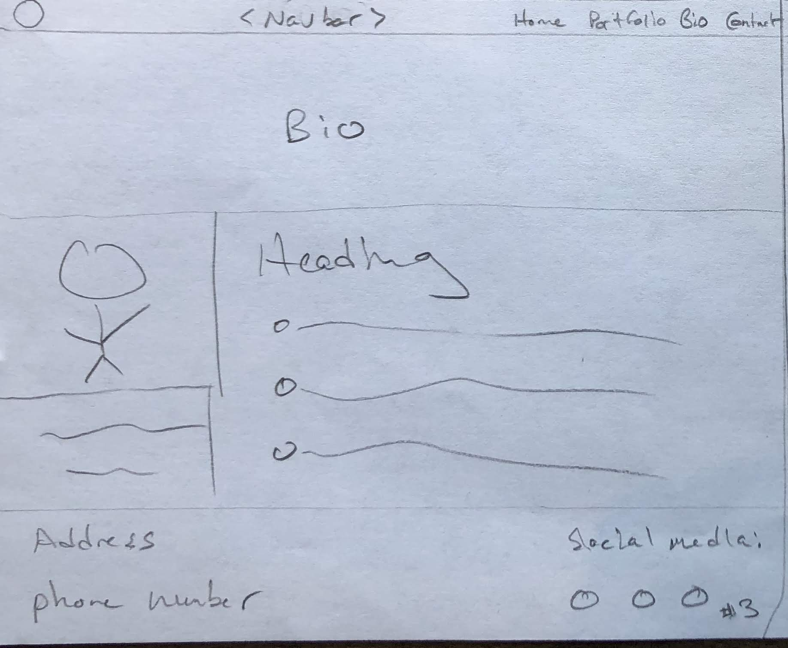

# FireFly Aerial Photography

FireFly specializes in aerial photography using drones. For this project, I want to showcase the incredible perspective that drone imagery provides and pursuade the user to hire me for a job. This website is a place where users can see how FireFly is a good choice compared with the competition, take a peek at some of the past work, read about the history, and contact me to inquire about work. 
 
## UX
 
This website is for consumers who want drone pictures or videos. They could be businesses that are looking to document their facilities from the air, real estate agents looking to sell a home, or average consumers looking for nice wall art.
The website should be enjoyable, they should want to peruse the inventory and it should be easy for them to navigate. The ultimate call to action will be a contact page to inquire about a print, or to request my services for a custom job.

*User Story - As a vinyard owner, I want to order a custom aerial photograph and print of my property, so that I can entice potential customers on my own vinyard website to visit my place of business or buy my wine* 

## Wireframes
There will be four pages to this project, a home page (index.html), a portfolio page, a bio page, and a contact us page. 

### Index Page

The index page should have a big, attention grabbing image and value proposition. Following that, I'd like to include a brief description of the company, and three reasons why patrons should choose to do business with us. The nav bar should be simple and the text should be Helvitica Nue. 

### Portfolio Page

This is where I showcase all the work. Images should be spaced and clearly visible. The content should be attention grabbing and convince customers that the quality of the artwork is impressive. 

### Bio Page

This is where I talk about the company and myself individually. An impressive resume and work-history will inspire potential customers to trust me. 

### Contact Us Page

The final page is where users can submit an email to me. Prompts on the page will encourage them to reach out if they have a project in mind. Right now, the contact form is not connected to anything on the backend, but in future work it will actually send an email. 

## Features
The features should make the site enjoyable and easy to navigate. 
 
### Existing Features
* Responsive Design
* Buttons
* Fixed background image
* Image gallery
* Contact form
* External social media links
* Youtube video

### Features Left to Implement
* Marketplace
* Social media feeds/links
* Chat window
* Image carousel
* Responsive portfolio grid (change # of columns/automatically resize image)
* Youtube links
* Slide shows
* Map of place of business/coverage area

## Technologies Used
* HTML - language to code the pages
* CSS - language to style the pages
* Bootstrap - [Bootstrap](https://getbootstrap.com/) to easily create a responsive, mobile first design
* Font Awesome Icons - [Font Awesome](https://fontawesome.com/) Easy icons
* Gitpod - [Gitpod](https://gitpod.io) Lightweight IDE
* Github - [Github](https://github.com/) Version management

## Testing

### Individual Testing
Throughout the project I did extensive testing as I coded. I had multiple tabs open, and after each change, I saved the document and refreshed the tabs to see how the changes got implemented. I used chromes developer tools to check margins/padding as well as debug any issues that arose. I checked the site in not only desktop resolutions but also medium sized and mobile as well. Throughout coding, I would periodically "beautify" the code which would expose open divs or missing wrappers. Additionally, the Gitpod interface is very good at highlighting items in red when they will not work. 

### Mentor Testing
Halfway through the project I shared the IDE with my mentor and we stepped through the site together. He provided helpful feedback on font discrepancies and checked that all of the links and images were up and working for a third-party.

### Friend Testing
Lastly, I sent the site to a friend so he could test for bugs and provide feedback. 

## Deployment
I used Gitpod to make changes and commits. Throughout the bulk of the project, I did not have any branches, but with this readme file I decided to explore with branching, creating a pull request, and merging into the master. For the deployment, I decided to use github pages as it was the simplest option. 

## Credits
I'd like to thank my mentor, Moosa for his help on the project as well as my friend Austin for reviewing the site. 

### Content
I used documentation from Bootstrap for a few sections, such as the navbar. The rest of the features/code were based off of components from code institute projects throughout modules 1-5. 

### Media
All of the images hosted on this site are my intellectual property. FireFly is a real company, registered in the state of California. My hope for this site and this program is to build a fully functional eCommerce website where customers can order prints from the skies of California directly to their doors. 

## References
* Bootstrap
* Font Awesome
* Code Institute Modules/Mini-Projects
* FireFly Solutions, LLC
